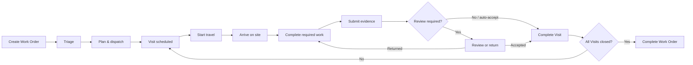

# FSM Canonical Execution — Product And Architecture Blueprint

Status: proposed implementation blueprint for v0.5 commercial evaluation  
Evidence: [FSM Owner E2E Run — 2026-07-14](../releases/fsm-owner-e2e-run-2026-07-14.md)  
Normative baseline: [v0.5.1 Commercial FSM Productization Technical Specification](./v0.5.1-commercial-fsm-productization-technical-spec.md)

## 1. Decision

Runory should not repair the failed FSM journey with page-specific buttons,
special queries, or status synchronization. The platform contract should be:

1. **Commands own business change.** Generic CRUD owns descriptive data only.
2. **Work Items own human obligations.** My Work reads Work Items rather than
   inventing tasks from Pack-specific tables.
3. **Schedule Entries own time/resource reservations.** Planning is one platform
   projection over those entries and a backlog of schedulable work.
4. **Versioned Forms own required work and evidence.** Completion checks a
   positive requirement snapshot, not merely the absence of pending forms.
5. **Domain Events own operational history.** Activity is a projection, not a
   second editable lifecycle.
6. **Packs contribute contracts and presentation metadata.** Platform pages do
   not hard-code FSM, Quote, Ticket, or future Pack tables.

The product remains simple because users never see those internal concepts. A
dispatcher sees **Plan & dispatch**; a technician sees the required work and
**Submit work**; a supervisor sees **Review evidence** and **Complete work
order**.

## 2. Product Mental Model

| User concept | Authoritative owner | Meaning |
| --- | --- | --- |
| Work Order | Work Order aggregate | Customer commitment and service boundary |
| Visit | Service Visit aggregate | One schedulable field occurrence under a Work Order |
| Assignee | Active Assignment | Who currently owns the Visit |
| Schedule | Confirmed Schedule Entry | When/where the Visit reserves a resource |
| Required work | Pinned requirement snapshot | What must be completed and evidenced |
| My Work item | Work Item | A human obligation for an actor/resource/team |
| Activity | Event projection | What happened, by whom, and when |

Users should not need to understand aggregate versions, command keys, Work
Items, bindings, projections, or Pack internals.

## 3. Canonical Journey



The visible path is:

```text
Work Order → Plan & dispatch → Planning/My Work → Visit execution
→ evidence/review → Work Order completion
```

Service Visit is contextual. It does not need a primary left-navigation item;
it is reached from Work Order, Planning, My Work, Activity, or a direct link.

## 4. Aggregate And State Boundaries

### 4.1 Work Order

```text
new --triage--> triaged --create_visit/plan--> planned
planned --start--> in_progress --complete--> completed
non-terminal --block--> blocked --unblock--> previous active state
non-terminal --cancel--> cancelled
completed/cancelled --reopen--> triaged or planned by explicit policy
```

A Work Order becomes `planned` when a valid Visit is created through the
governed command. Editing dates or an assignee cannot simulate planning.

### 4.2 Service Visit

```text
scheduled --start_travel--> en_route --arrive--> on_site
on_site --complete--> completed
non-terminal --cancel--> cancelled
```

Submission/review is an orthogonal readiness projection:

```text
not_started → in_progress → ready_to_submit → submitted
submitted → accepted
submitted → returned → in_progress
```

This avoids multiplying Visit states while still showing **On site · 3 of 4
required items complete** or **Awaiting review**.

### 4.3 Assignment And Schedule

`assignment` and `schedule_entry` are authoritative platform records. Fields
such as `assigned_to`, `technician_id`, and `scheduled_start` are read-only
compatibility projections until retired. Reassign/reschedule/conflict override
are commands; no UI, Automation, MCP tool, or agent coordinates parallel writes.

## 5. Three Platform Contracts

### 5.1 Action Contract

The detail UI must stop deriving actions with hard-coded object/state branches.
It asks the command catalog for the current action context:

```http
GET /api/workspaces/{workspaceId}/objects/{objectKey}/records/{recordId}/actions
```

```json
{
  "stage": { "key": "triaged", "label": "Ready to plan" },
  "primary": {
    "command": "work_order.create_visit",
    "label": "Plan & dispatch",
    "inputSchema": "fsm.visit-plan.v1",
    "presentation": "command_panel"
  },
  "secondary": [
    { "command": "work_order.block", "label": "Block" },
    { "command": "work_order.cancel", "label": "Cancel" }
  ],
  "readiness": { "ready": true, "blockingReasons": [] },
  "version": 2
}
```

The command handler remains authoritative. Manifest metadata supplies labels,
input presentation, and placement; it never duplicates invariant logic. The
response is actor-, permission-, state-, assignment-, and version-aware.

### 5.2 Work Requirement Contract

A Pack contributes a versioned form binding or requirement template. Creating
a Visit pins an immutable snapshot containing:

```text
requirement key/label and source version
required/optional and completion rule
evidence and review policy
actor/resource eligibility
```

The default FSM template should include:

- safety/access acknowledgment;
- inspection checklist with pass/fail/not applicable;
- note required for failed items;
- condition/result photo;
- work summary;
- customer acknowledgment/signature when configured.

Completion readiness is positive:

```text
all required instances exist
AND all required values are valid
AND required evidence is durable
AND latest revision is accepted, or auto-accept policy applies
AND no returned revision is unresolved
```

“Zero submitted-but-unaccepted forms” is not sufficient because zero forms
would incorrectly pass.

### 5.3 Projection Contribution Contract

Packs contribute subject presentation and operational capability metadata;
platform APIs own query, authorization, pagination, and response shape.

```yaml
operationalContributions:
  - subjectType: service_visit
    object: service_visit
    route: /service-visits/{id}
    displayField: title
    customerRelation: work_order.company_id
    siteRelation: work_order.service_site_id
    locationRelation: work_order.service_site_id
    schedulable: true
    executable: true
```

The platform resolves this through the installed object/relation registry. It
must not contain hard-coded subject-to-table maps. Unknown or uninstalled types
remain readable through retained presentation snapshots.

## 6. One Atomic Plan & Dispatch Command

`work_order.create_visit` is the canonical Plan & dispatch command. One unit of
work atomically:

1. validates Work Order state/version and actor permission;
2. validates technician, datetime, timezone, site, and conflicts;
3. creates the Service Visit in `scheduled`;
4. creates/confirms Assignment and Schedule Entry;
5. pins the required-work snapshot;
6. creates the technician's operational Work Item;
7. moves the Work Order from `triaged` to `planned`;
8. writes domain events, audit, and durable projection/outbox work.

If any step fails, none persists. The current pattern in which Assignment or
Schedule side effects can be written before aggregate commit must be removed.

```json
{
  "workOrder": { "id": "rec_...", "status": "planned", "version": 3 },
  "visit": { "id": "visit_...", "status": "scheduled", "version": 1 },
  "assignmentId": "asg_...",
  "scheduleEntryId": "sched_...",
  "workItemId": "wi_...",
  "warnings": [],
  "nextAction": { "command": "work_order.start", "label": "Start work" }
}
```

## 7. My Work, Planning, And Activity

### 7.1 My Work

My Work queries Work Items only. Commands and optional Workflow V2 both create
them through the same contract. Plan & dispatch creates a `field_execution`
Work Item for the technician; reassignment changes Assignment and Work Item
assignee atomically; Visit completion completes it.

This removes the Pack-specific union that currently synthesizes tasks by joining
Schedule Entry to Work Order and Service Visit tables.

### 7.2 Planning

Planning has two platform-owned sources:

- **Backlog:** schedulable obligations without confirmed Schedule/Assignment.
- **Calendar/timeline/map:** Schedule Entries enriched through installed subject
  presentation contributions.

All views consume one DTO and its `availableCommands`. Drag/drop invokes
assignment/schedule commands with expected versions; it never edits projections.

### 7.3 Activity

Every command writes canonical events and audit in the same transaction. A
durable projector creates one permission-filtered timeline. Subject types are
stable (`service_visit`, not mixed `visit`/`service_visit`). Idempotency keys
prevent repeated command effects.

## 8. Product Experience

### 8.1 Work Order Detail

```text
┌ Work Order title                         Ready to plan ┐
│ Customer · Site · SLA              [Plan & dispatch] [···] │
├ Overview ----------------------------------------------------┤
│ Priority · asset · description · service context             │
├ Visits (0) --------------------------------------------------┤
│ No visit planned                                             │
│ Choose a technician and time to dispatch this work.          │
├ Work & evidence ---------------------------------------------┤
│ Appears after a visit is planned                             │
├ Activity ----------------------------------------------------┤
│ Created · triaged                                            │
└──────────────────────────────────────────────────────────────┘
```

There is one dominant primary action. Block, Cancel, Reopen, and diagnostics
live in overflow.

**Plan & dispatch** opens a short contextual command panel:

```text
Technician       [David Park         ▾]
Start            [Jul 15, 09:00]
End              [Jul 15, 12:00]
Timezone         [Asia/Shanghai      ▾]
Site             [Acme Warehouse]
Conflict         No conflicts
Required work    HVAC inspection v2 · 6 items

                         [Cancel] [Plan & dispatch]
```

A right-side panel is appropriate because this is a bounded command, not a
long-lived record editor. Forms, Workflow, Automation, Members, and Pack
configuration remain full pages.

### 8.2 Planning

- Backlog stays beside Calendar/Timeline/Resource/Map.
- Dropping backlog work on a resource/time opens the same prefilled panel.
- Clicking a Visit offers Open, Reassign, Reschedule, and Unschedule.
- Day/Week/Month controls change range, navigation unit, and label together.

### 8.3 Technician Execution

```text
Visit summary → Start travel → Arrive
→ required work cards → Save draft → Submit work
→ Awaiting review / Completed
```

Required items show progress and exact blockers. Complete Visit is not presented
as valid while required work is missing.

### 8.4 Supervisor/Owner Closure

When review is required, Submit work creates a review Work Item. For a small
Owner-only workspace, policy may allow **Accept & complete visit**, but evidence
acceptance and Visit completion remain separately audited governed effects.

After all Visits close, the primary action becomes **Complete work order** with
a readable Visit/evidence summary, never a raw status selector.

## 9. Generic CRUD Rules

- Lifecycle fields are never editable.
- Assignee/schedule projections are read-only and link to their commands.
- Generic Service Visit Create is disabled when creation belongs to a parent
  command.
- Generic update accepts descriptive fields only when policy permits.
- Rejected governed writes return the allowed command and recovery action.

## 10. Pack Install And Uninstall

Installation registers command/action presentation, permissions, operational
subject presentation, Work Item kinds, requirement bindings, navigation,
widgets, and event presentation.

On uninstall:

- new commands/navigation are disabled;
- active obligations require explicit migration/cancellation policy;
- retained records/events/evidence/presentation snapshots stay readable;
- unavailable handlers surface an administrator diagnostic;
- no shared platform table or another Pack's data is implicitly deleted.

The same contract applies to FSM, Sales Quote, Ticketing, Returns, Maintenance,
and future Packs.

## 11. Implementation Slices

### Cross-Cutting Forms & Checklists Contract

Forms are a shared platform capability used by Packs, not an FSM-owned CRUD
object. The product separates five concerns:

1. **Form definition** — reusable administrator-managed template.
2. **Immutable version** — the exact published schema used for validation.
3. **Usage policy** — business context and requirement policy, such as
   `Every Service Visit before completion`.
4. **Visit requirement** — dispatch-time snapshot of the selected binding and
   immutable form version.
5. **Submission** — revisioned evidence associated with the Visit and execution
   Work Item.

The Visit owns field-delivery requirements. The Work Order exposes a read-only
roll-up across its Visits and never duplicates their submissions. Work
Order-level approval or closure forms may still bind directly to the Work Order.

Administration presents this capability as **Forms & checklists** with Form
library, Usage policies, and Submissions & review. Runtime surfaces present
business names and statuses; binding IDs and usage keys are diagnostics only.

Editing and republishing a form affects future dispatches only. Existing Visits
must render and validate against their pinned version. Re-saving an identical
usage policy is idempotent so it cannot multiply required deliverables.

### Slice A — Restore The Governed FSM Spine (P0)

1. Register/expose `work_order.create_visit` as **Plan & dispatch**.
2. Remove hard-coded business action derivation from `ObjectDetailPage`.
3. Disable generic Visit create and governed status/schedule/assignment writes.
4. Make Visit, Assignment, Schedule, Work Item, requirements, Work Order state,
   event, and audit one transaction.
5. Add failure-injection and idempotency tests.

Exit: Owner reaches `planned` without hidden routes or generic status edits.

### Slice B — Make Field Work Real (P0)

1. Ship one published FSM service form/binding in the demo template.
2. Pin requirements during Plan & dispatch.
3. Render required work in desktop/mobile Visit execution.
4. Replace the negative pending-form check with positive readiness.
5. Test submit, return, resubmit, accept, and completion.

Exit: empty work cannot be submitted or completed.

### Slice C — Unify Platform Projections (P1)

1. Create operational Work Items from commands; remove schedule-synthesized My
   Work rows.
2. Replace Planning subject table maps with contribution metadata.
3. Normalize event types and project all commands to Activity.
4. Return actions/readiness/presentation in My Work and Planning DTOs.

Exit: detail, My Work, Planning, and Activity agree after command/retry/failure.

### Slice D — Product Polish And Exceptions (P1/P2)

1. Planning backlog and drag/drop command panel.
2. Conflict override with permission/reason.
3. Multi-Visit, cancel, block/unblock, reopen, reassign, and reschedule paths.
4. Datetime/timezone controls and localized stage labels.
5. Administrator diagnostics for command/version/projection lag.

Exit: Owner, Dispatcher, Technician, and Supervisor suites pass.

## 12. Non-Negotiable Acceptance Rules

1. Every lifecycle edge is a named command.
2. Every screen obtains actions from one action contract.
3. Generic CRUD cannot create/mutate governed lifecycle state.
4. Plan & dispatch commits aggregate and platform effects coherently.
5. Required work is positively proven before Visit completion.
6. My Work contains only authorized actionable obligations.
7. Planning views share one schedule/backlog contract.
8. Activity displays every successful command once with actor/timestamp.
9. Pack install/uninstall requires no platform page code change.
10. The Owner E2E Runbook passes through visible UI only.
